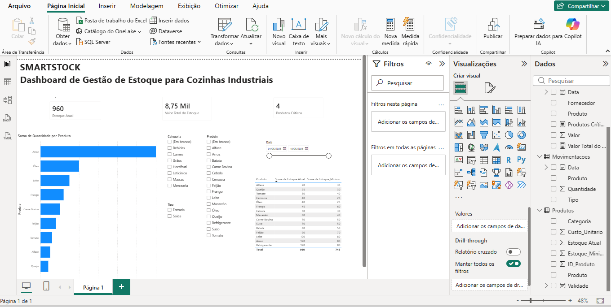

# SmartStock BI

## Dashboard de Gestão de Estoque para Cozinhas Industriais

Projeto desenvolvido em Power BI para monitoramento e controle de estoque de cozinhas industriais, permitindo análise rápida dos produtos, movimentações e itens críticos.

---

## Objetivo

Criar um dashboard interativo para auxiliar no acompanhamento do estoque, identificação de produtos críticos e análise das movimentações de entrada e saída.

---

## Dashboard

---

## Indicadores

- Estoque Atual
- Valor Total do Estoque
- Produtos Críticos
- Movimentações de Entrada e Saída

---

## Filtros Disponíveis

- Categoria
- Produto
- Tipo de Movimentação
- Data

---

## Funcionalidades

- Monitoramento de estoque em tempo real
- Identificação de produtos abaixo do estoque mínimo
- Controle de entradas e saídas
- Filtros dinâmicos
- Dashboard interativo

---

## Tecnologias Utilizadas

- Power BI
- DAX
- Excel
- Modelagem de Dados

---

## Arquivos do Projeto

- Dashboard Power BI
- Relatório em PDF
- Imagem do Dashboard

---

## Autor

Giovanna Gomes Oliveira

Estudante de Inteligência Artificial e apaixonada por Dados, Business Intelligence e Machine Learning.

LinkedIn: INSERIR LINK

GitHub: INSERIR LINK